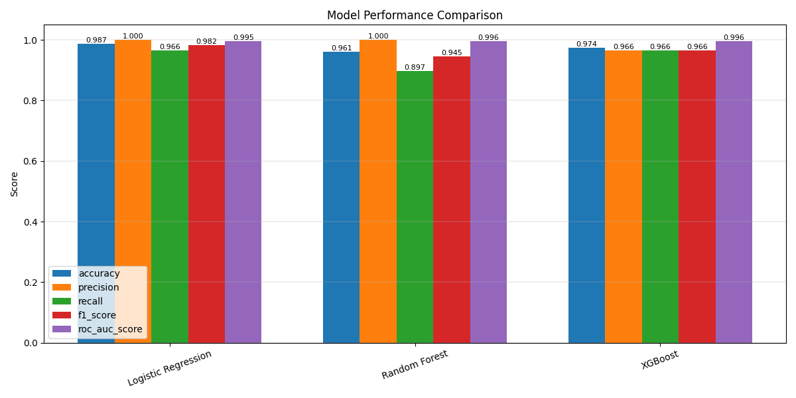

# ml-ThyRP
### A machine learning project predicting the recurrence of well differentiated thyroid cancer.
Done as the Midterm Project for the Data Talks Club Machine Learning Zoomcamp 2025.

## Problem Statement
Thyroid cancer mortality is not high. But the risk of recurrence is significant. Rescources and time can be managed much better, if we can predict the risk of recurrence in a patient. We can thus modify treatment methods accordingly and monitor patients who are at risk of recurrence more closely with regular follow-ups, while those with low risk need to come in less frequently. Automating this decision and scheduling frees up valuable time for healthcare workers and gives them a clean information set for decision making.

In this case, any patient with recurrence risk > 50% was monitored more closely, but one could also stratify the patients into specific risk categories (e.g., low, medium, high).

## The Dataset
`Thyroid_Diff.csv` in this repository. It is a dataset obtained from the [UC Irvine Machine Learning Repository](https://archive.ics.uci.edu/).

>> Citation: Borzooei, S., Briganti, G., Golparian, M. et al. Machine learning for risk stratification of thyroid cancer patients: a 15-year cohort study. Eur Arch Otorhinolaryngol 281, 2095–2104 (2024). https://doi.org/10.1007/s00405-023-08299-w
>> The dataset and details about it are available [here](https://archive.ics.uci.edu/dataset/915/differentiated+thyroid+cancer+recurrence).


The dataset contains 13 clinopathologic features, all categorical apart from age. The target is `recurred`.


## Approach
After initial cleaning and exploratory data analysis, three different models were trained and tuned on the data: Logistic Regression, Random Forest Classifier, and XGBoost Classifier. Their performance was compared, and XGBoost was chosen as performing the best and most consistently. This is the model that was deployed for use.

The entire training, tuning, and performance comparison can be found in `notebook.ipynb`.
Performance comparison:
()

## Getting Started

This project provides a FastAPI service for predicting thyroid cancer recurrence using an XGBoost model.
You can run it in two ways:
In Docker, using the included Dockerfile
Locally, using a virtual environment managed by uv
Both workflows are documented below.

### 1. Clone this repository:
```bash
git clone https://github.com/malenaduroux/ml-ThyRP
cd mlThyRP
```
Or do this manually on Github by forking the repository. You can then create a Github Codespace to work in if you like.

